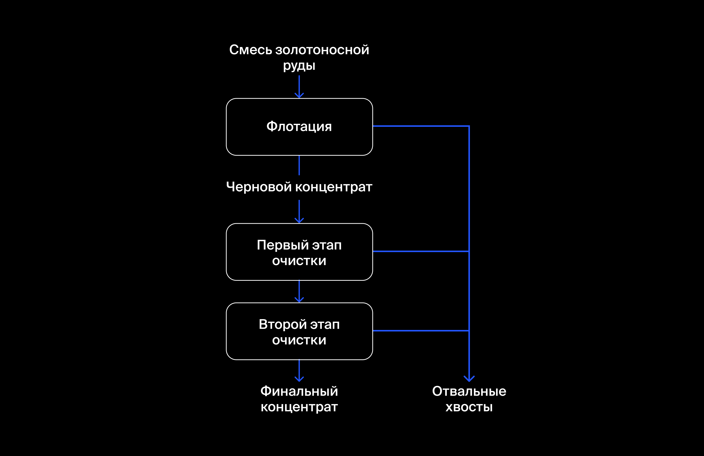

Проект из обучающих курсов Яндекс. Практикум

# To-predict-the-coefficient-of-restitution-Au
Предсказать коэффициент восстановления золота из золотосодержащей руды

## Технологический процесс

Как золото получают из руды?
Когда добытая руда проходит первичную обработку, получается дроблёная смесь. Её отправляют на флотацию (обогащение) и двухэтапную очистку.

Опишем каждую стадию:

### 1. Флотация

Во флотационную установку подаётся смесь золотосодержащей руды. После обогащения получается черновой концентрат и «отвальные хвосты», то есть остатки продукта с низкой концентрацией ценных металлов.
На стабильность этого процесса влияет непостоянное и неоптимальное физико-химическое состояние флотационной пульпы (смеси твёрдых частиц и жидкости).

### 2. Очистка

Черновой концентрат проходит две очистки. На выходе получается финальный концентрат и новые отвальные хвосты.

## Данные находятся в трёх файлах:

### gold_recovery_train.csv — обучающая выборка;
### gold_recovery_test.csv — тестовая выборка;
### gold_recovery_full.csv — исходные данные.

